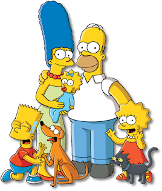
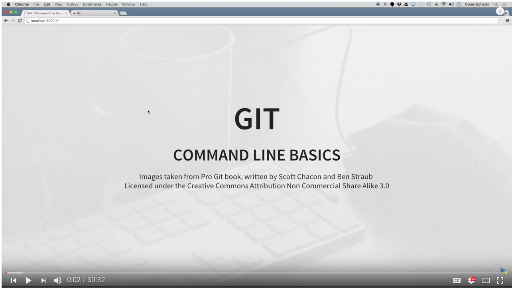
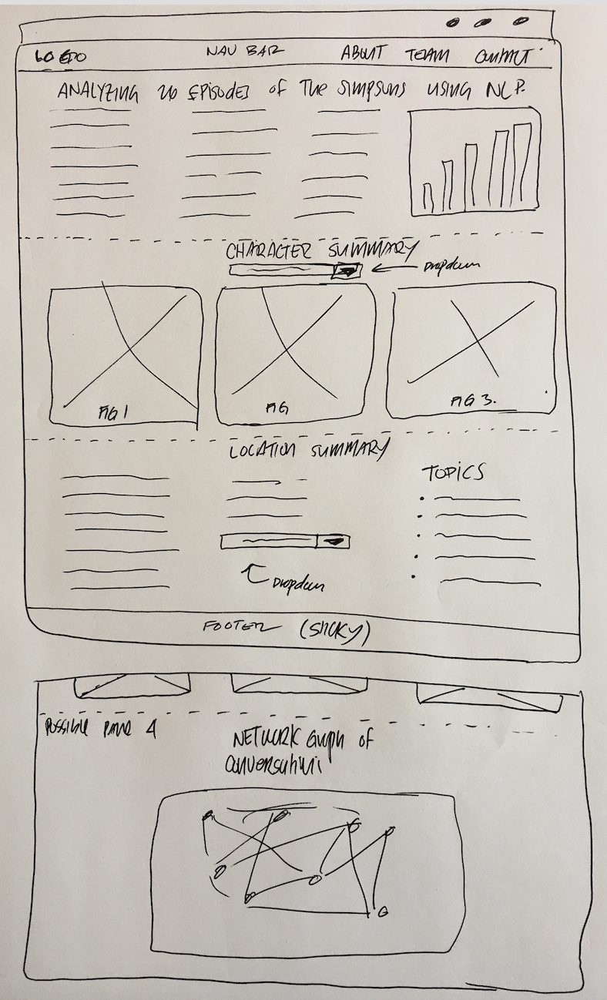

# Analyzing 26 Episodes of *The Simpsons* Using Natural Language Processing (NLP)



## Project Proposal

For this project, we'll use ['The Simspons By the Data'](https://www.kaggle.com/wcukierski/the-simpsons-by-the-data/data) dataset from kaggle to find and visualize various trends using natural language processing (NLP).  Specific questions that this project will answer will include the following.

> Which the characters that have the most complex speech patterns using the Flesch Reading Ease and Flesch-Kincaid Grade Level metrics?
>
> Which the characters that have the most simplistic speech patterns using the Flesch Reading Ease and [Flesch-Kincaid Grade Level](https://www.wikiwand.com/en/Flesch%E2%80%93Kincaid_readability_tests) metrics?
>
> How does the IMBD score of the episode related to the number of times that Homer Simpson says 'Doh!?"
>
> Which writers tend to have Homer Simpson say 'Doh!' the most?
>
> What are the general topics that are being discussed at the various locations/settings of the episode?  For example, what are the top 10 topics that the characters discuss while at Moe's Tavern?

Other data sources for this project include:

* [Simpsonswiki.org](https://simpsonswiki.com/wiki/Main_Page)
* [Simpsons API](https://thesimpsonsquoteapi.glitch.me)

## Team Members and Location of Repo

The project team includes four members.  The proposed team name is *The Simpsons*.

* [Victor Kuo](https://github.com/victoryk13)
* [Sungwon Byun](https://github.com/sungwonb)
* [Felipe Sinohui](https://github.com/fsinohui)
* [Grant Aguinaldo](https://github.com/grantaguinaldo)

The repo for this project can be found [here](https://github.com/victoryk13/Simpsons).  To ensure that we have no issues with version control, we will be the common pull/branch/merge workflow for git. For more on using git, you can check out the YouTube video below or by clicking [here](https://youtu.be/HVsySz-h9r4).




## Tools/Tech Stack

* SQL/SQLite
* SQLalchemy
* Python 3
* Jupyter Notebook
* Flask
* Heroku
* Javascript (ES6)
* Pandas
* Numpy
* matplotlib/Seaborn
* HTML/CSS/Bootstrap
* NLTK
* SK-Learn
* D3

## DataViz

To visualize the data from this project, our final deliverable will be a web-based dashboard that will be hosted in Heroku.

The final deliverable will have three panes each displaying data related to the analysis and the overall story.

**Pane 1.**  This pane will display descriptive statistics for the dataset as well as a short narrative about the project to build context for the audience.

Example statistics include: number of rows, types of data used, etc, and the data will be presented in the form of bar/line charts.  This pane will not have functionality.

**Pane 2.**  This pane will show some of the results related the language patterns from each of the characters.  For example, the *first* view will show the Flesch Reading Ease and Flesch-Kincaid Grade Level metrics for a given character along with some copy about what the values mean.  The *second* view will be a word cloud of the script for that character. The *thrid* and the final view will display some of the metdata from the character.  Since all of these views are related to the character, we will have a dropdown list of all of the characters in the dataset.  The three views will update using the `onchange` function within the `js` file.

**Pane 3.** The pane will show the results of the topics that are discussed in a select location.  For this pane, we will need to conduct an [Latent Dirichlet allocation (LDA)](https://www.wikiwand.com/en/Latent_Dirichlet_allocation)-based topic model using sk-learn.  The data will be displayed as an unordered list of the top 10 topics found at each location.  The contents of the list will update using the `onchange` function within the `js` file.

#### Wireframe

A **wireframe** of the final app is shown below.



## Work break down structure

This is the current work-breakdown structure for the project.

1.  Download data from Kaggle and other Internet sites and load into a SQLite file. **Victor**

2.  Query SQL database and find descriptive statistics for the dataset. **Victor**

3.  Investigate other sources for character metadata. **Victor**

4.  Investigate the inner monologue of characters. **Felipe**

5.  Create API Routes using Flask **All**

* List of character names **Grant**
* List of locations **Grant**
* Create Flesch Reading Ease and Flesch-Kincaid Grade Level metrics for each character using NLTK. **Felipe**
* Create top 10 list of the topics from each location using (LDA and Countvectorizer or [tf-idf](https://nlp.stanford.edu/IR-book/html/htmledition/tf-idf-weighting-1.html)) **Grant**
* Create list of inner monologues for characters. **Felipe**
* Create list of words to be used for a word cloud **Sungwon**

6.  Code in user interaction using javascript.  Use the `d3.json` functions to make the API calls to the respective endpoints. **Sungwon**

7.  Create final dashboard using HTML/CSS/Bootstrap.  We'll include a nav bar as well as a 'sticky' footer. **Sungwon**

8.  Push to Heroku.  For deployment on Heroku, we'll need to be sure that we have the following files inside of the repo. For eash in debugging any problems that arrise during the Heroku deployment, we'll all use a virtual environment. **Grant**

	* runtime.txt
	* run.sh
	* requirements.txt
	* Procfile

## Project Specifications

As noted in the project instructions, this project must include the following items.  This section explains how the proposed project will meet the requirements of the overall project.


1.  Your visualization must include a Python Flask powered RESTful API, HTML/CSS, JavaScript, and at least one database (MySQL, MongoDB, SQLite, etc.)

	**This project will use a SQLite database to store the data for the dashboard.  The entire webapp will be built around this database.**

2.  Your project should fall into one of the below four tracks:
A custom "creative" D3.js project (i.e. non-standard graph or chart).

	a) A combination of Web Scraping and Leaflet or Plotly

	b) A dashboard page with multiple charts all updating from the same data

	**This project will follow this track where data for various charts will be updated with the same data.  To effect this, we will incorporate a dropdown list into our dashboard.**

	c) A "thick" server that performs multiple manipulations on data in a database prior to visualization (must be approved)

	d) Your project should include at least one JS library that we did not cover.

3.  Your project must be powered by a dataset with at least 100 records.

	**The data for this project will be based on a dataset that has last least 100 records**

4.  Your project must include some level of user-driven interaction (e.g. menus, dropdowns, textboxes, etc.)

	**The data presented in panes two and three will have a drop-down menu as part of the user-driven interaction**

5.  Your final visualization should ideally include at least three views.

	**This project will include at least three views**


## File Structure of Project

We'll use this file structure for this project to keep things organized.

```
https://github.com/victoryk13/Simpsons
.
+-- app.py
+-- api.py
+-- lda.py
+-- runtime.txt
+-- run.sh
+-- requirements.txt
+-- Procfile
+-- data
|   +-- data.sqlite
+-- static
|   +-- css
|		+-- stylesheet.css
|   +-- js
|		+-- app.js
+-- images
+-- templates
	+-- index.html
	+-- about.html
	+-- contact.html

```
... more to be added ....

***
